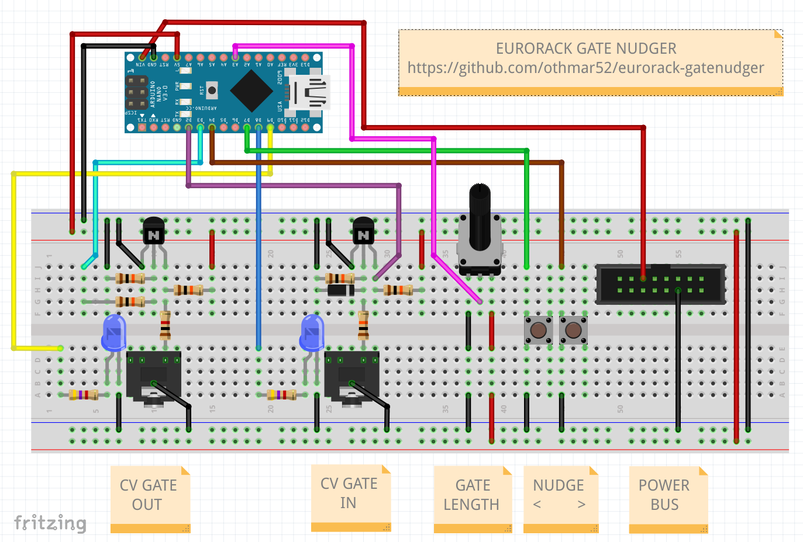

# eurorack gate nudger

arduino based eurorack module to add or remove single gate pulses  
very useful in combination with the TuringMachine (https://github.com/TomWhitwell/TuringMachine)  
this module gives us the possibility to nudge a locked sequence left and right on the "timeline" by adding or supressing single gate pulses  
further it is possible to increase the gate length with a potentiometer  

## parts
 - Arduino
 - 2 x 3.5mm TRS female jacks (CV clock in/out)
 - 2 x NPN Transistor N3904 (CV in/out circuit)
 - 6 x Resistor 10K (CV in/out circuit)
 - 1 x Resistor 1K (CV out circuit)
 - 1 x Diode 1N4148 (CV in circuit)
 - 2 x LED blue (in/out gate indicator)
 - 2 x Resistor 4.7K (for 2 LEDs)
 - 1 x Trimpot 10K (for gate length)
 - 2 x Pushbuttons (for nudging)
 - 1 x Box Header 16 pin (for connection to power BUS)
## circuit
  

